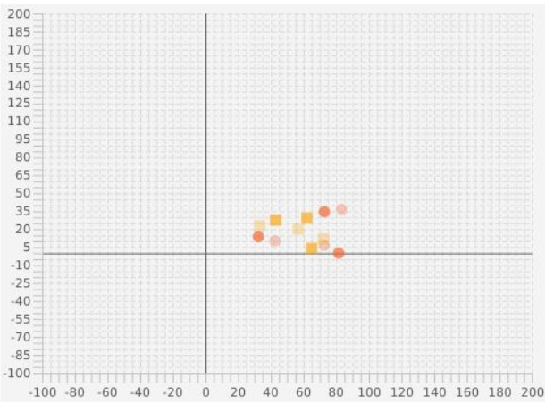
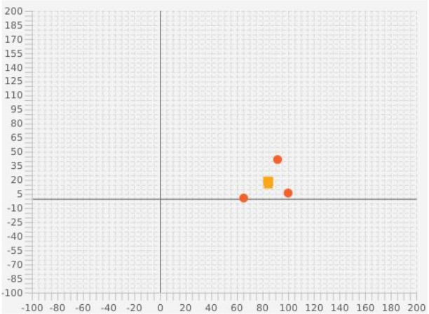
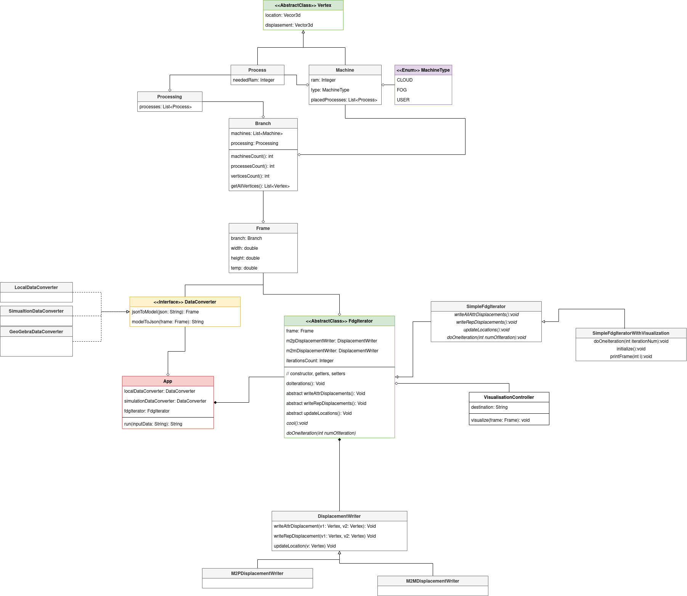

# IOT Calculation Distribution

## Goal
The aim was to create an algorithm to assign processes
of Internet of Things to proper nodes(cloud, fog, sensor) using 
Force-directed graph Drawing algorithms and test it with IoTSim-Edge simulator.

## Working Example
We created a visualization for the algorithm using JavaFX.

The result of the algorithm:

Orange squares - processes

Red circles - machines

It shows how processes could be attached to machines.

## Program structure

### Details
For more details read our [report](./doc/IOT_Calc_Dist-report.pdf).