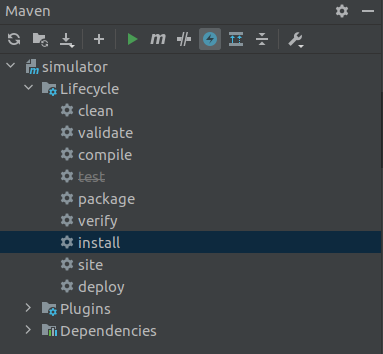

### How to install IoTSim-Edge
- Clone git repository from https://github.com/DNJha/IoTSim-Edge
- Import into Intellij like any other project
- In pom.xml:
  
  interchange following dependency(which is originally commented):

  ```
    <dependency>
    <groupId>org.cloudbus.cloudsim</groupId>
    <artifactId>cloudsim</artifactId>
    <version>3.0.3</version>
    </dependency>
    ```

  with:

  ```
  <dependency>
  <groupId>org.cloudbus.cloudsim</groupId>
  <artifactId>cloudsim</artifactId>
  <version>3.0.3</version>
  <scope>system</scope>
  <systemPath>${project.basedir}/lib/cloudsim.jar</systemPath>
  </dependency>
  ```
- There are some test, that do not pass, so disable them:
  * In Intellij window click Maven(on the left) and Toggle Skip Tests Mode(blue button):
  
- Click install in the same window
- One should see BUILD SUCCESS

### How to run examples
- Choose an example from
`/src/main/java/examples`
- Right click on the selected class
- Run '[example_name].main()'
- The result will appear in the terminal

### How to run GUI application
- Change JDK and Language Level to 8 as follows:

  `File->Project Structure->Project SDK-> 1.8`
- Install with Maven as in the [How to install IoTSim-Edge](#how-to-install-iotsim-edge)
- Run `/src/main/java/org.edge.ui/Main`
  
    